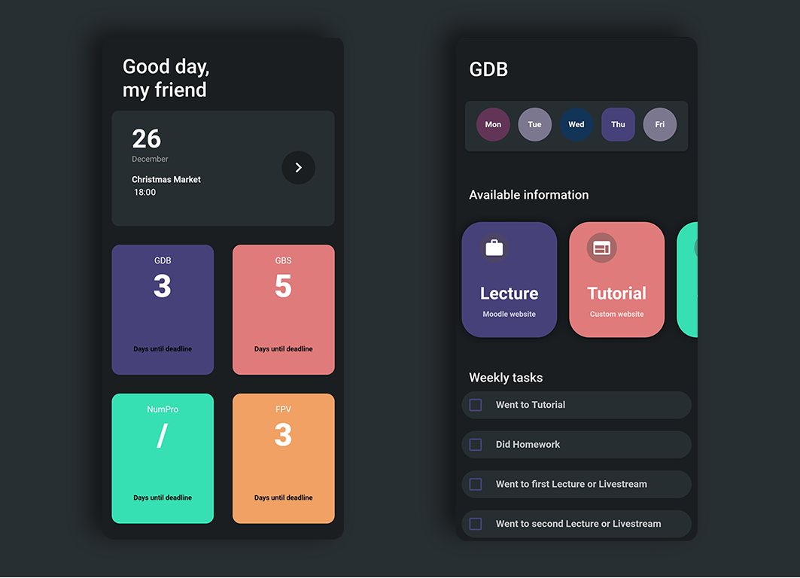

# tumh 
Many courses at university choose to use their own website, thus making the life of students a pain. Having to search through a massive
amount of websites and creating bookmarks for each website simplifies this workload, but does not make it easy.
This experimental App written with Flutter thus helps dealing with this process in a organized way.

## Features
* Integration with native calendar app
* Integration with native browser
* Visual presentation of all available courses
* Visualization of daily events

What is it good for?
* Easy management of different websites of each course
* Fast and simple way to access platforms like moodle

## Dependencies
The app was tested and developed for the Android platform. It was not tested for IOS, but should also work on that.
* Flutter SDK v1.12
* Android SDK

### Development
This app was developed over two days. More features could be added over time.

### Acknowledgements
* [Inspiration](https://www.designbysie.com/)
